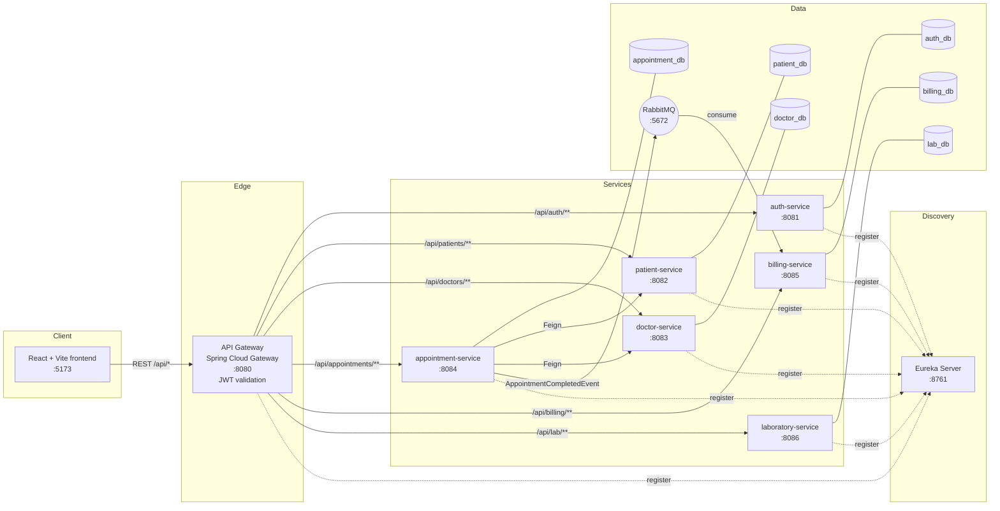

# Architecture diagram

```mermaid
flowchart LR
    subgraph Client
        FE[React + Vite frontend<br/>:5173]
    end

    subgraph Edge
        GW[API Gateway<br/>Spring Cloud Gateway<br/>:8080<br/>JWT validation]
    end

    subgraph Discovery
        EUR[Eureka Server<br/>:8761]
    end

    subgraph Services
        AUTH[auth-service<br/>:8081]
        PAT[patient-service<br/>:8082]
        DOC[doctor-service<br/>:8083]
        APP[appointment-service<br/>:8084]
        BIL[billing-service<br/>:8085]
        LAB[laboratory-service<br/>:8086]
    end

    subgraph Data
        PG_AUTH[(auth_db)]
        PG_PAT[(patient_db)]
        PG_DOC[(doctor_db)]
        PG_APP[(appointment_db)]
        PG_BIL[(billing_db)]
        PG_LAB[(lab_db)]
        MQ((RabbitMQ<br/>:5672))
    end

    FE -->|REST /api/*| GW
    GW -->|/api/auth/**| AUTH
    GW -->|/api/patients/**| PAT
    GW -->|/api/doctors/**| DOC
    GW -->|/api/appointments/**| APP
    GW -->|/api/billing/**| BIL
    GW -->|/api/lab/**| LAB

    AUTH --- PG_AUTH
    PAT --- PG_PAT
    DOC --- PG_DOC
    APP --- PG_APP
    BIL --- PG_BIL
    LAB --- PG_LAB

    APP -- Feign --> PAT
    APP -- Feign --> DOC
    APP -- "AppointmentCompletedEvent" --> MQ
    MQ -- consume --> BIL

    AUTH -. register .-> EUR
    GW -. register .-> EUR
    PAT -. register .-> EUR
    DOC -. register .-> EUR
    APP -. register .-> EUR
    BIL -. register .-> EUR
    LAB -. register .-> EUR
```
