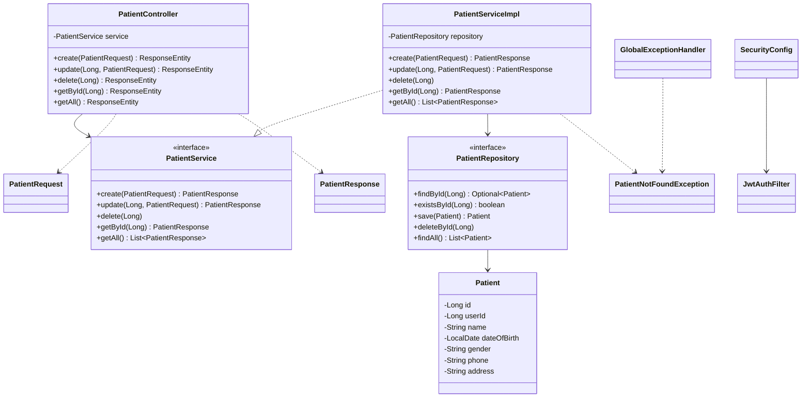

# Class diagram

Layered architecture, shown for one representative service (patient-service). Other services follow the same pattern.

```mermaid
classDiagram
    class PatientController {
        -PatientService service
        +create(PatientRequest) ResponseEntity
        +update(Long, PatientRequest) ResponseEntity
        +delete(Long) ResponseEntity
        +getById(Long) ResponseEntity
        +getAll() ResponseEntity
    }

    class PatientService {
        <<interface>>
        +create(PatientRequest) PatientResponse
        +update(Long, PatientRequest) PatientResponse
        +delete(Long)
        +getById(Long) PatientResponse
        +getAll() List~PatientResponse~
    }

    class PatientServiceImpl {
        -PatientRepository repository
        +create(PatientRequest) PatientResponse
        +update(Long, PatientRequest) PatientResponse
        +delete(Long)
        +getById(Long) PatientResponse
        +getAll() List~PatientResponse~
    }

    class PatientRepository {
        <<interface>>
        +findById(Long) Optional~Patient~
        +existsById(Long) boolean
        +save(Patient) Patient
        +deleteById(Long)
        +findAll() List~Patient~
    }

    class Patient {
        -Long id
        -Long userId
        -String name
        -LocalDate dateOfBirth
        -String gender
        -String phone
        -String address
    }

    class PatientRequest
    class PatientResponse
    class PatientNotFoundException
    class GlobalExceptionHandler
    class JwtAuthFilter
    class SecurityConfig

    PatientController --> PatientService
    PatientServiceImpl ..|> PatientService
    PatientServiceImpl --> PatientRepository
    PatientRepository --> Patient
    PatientController ..> PatientRequest
    PatientController ..> PatientResponse
    PatientServiceImpl ..> PatientNotFoundException
    GlobalExceptionHandler ..> PatientNotFoundException
    SecurityConfig --> JwtAuthFilter
```
