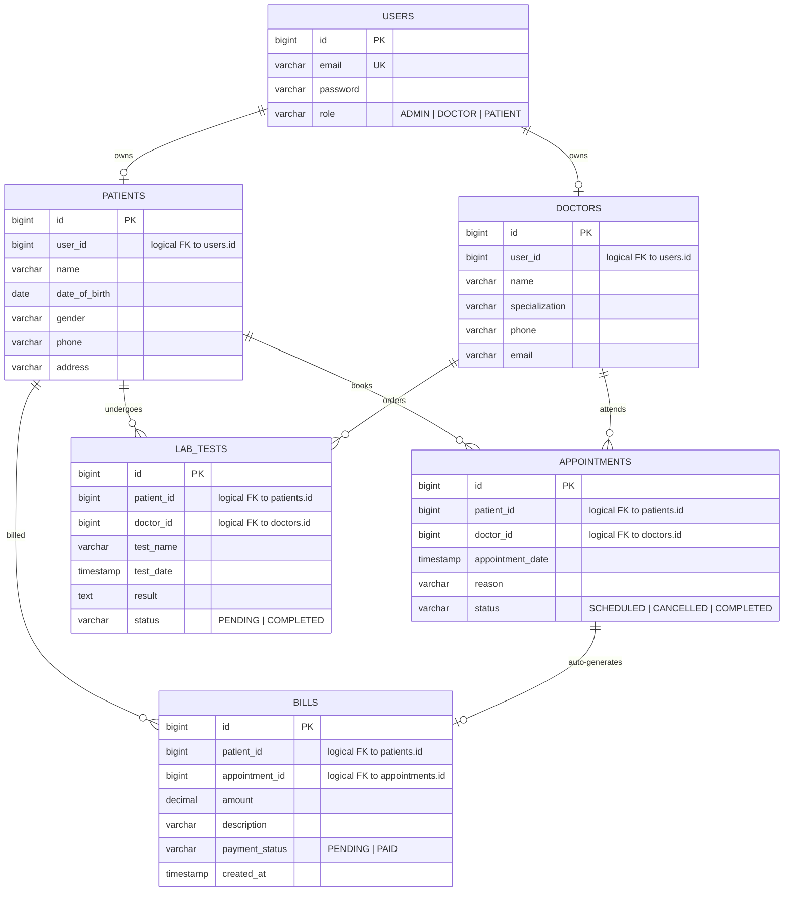

# Entity-relationship diagram

Each service owns its own database. Cross-service references are by ID only (no FK constraints across services — relationships are logical, enforced at the application layer).

