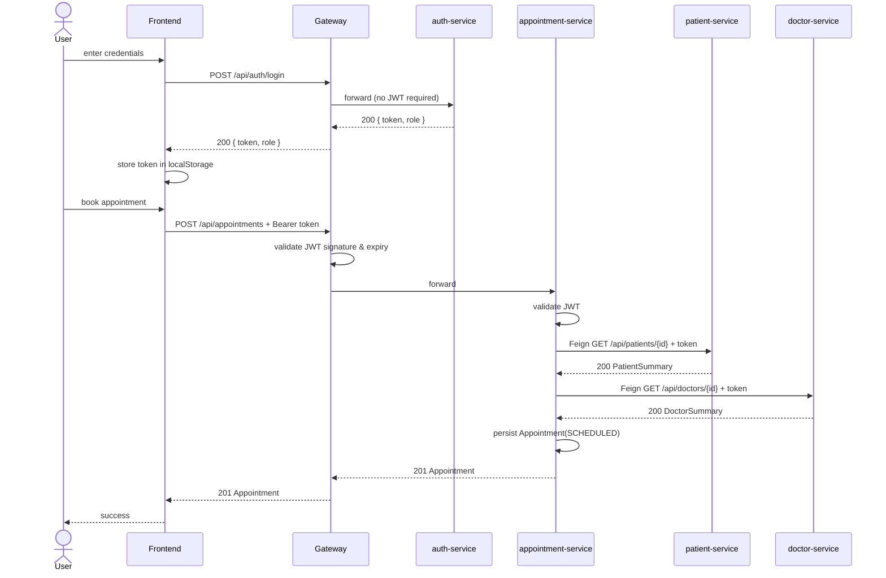
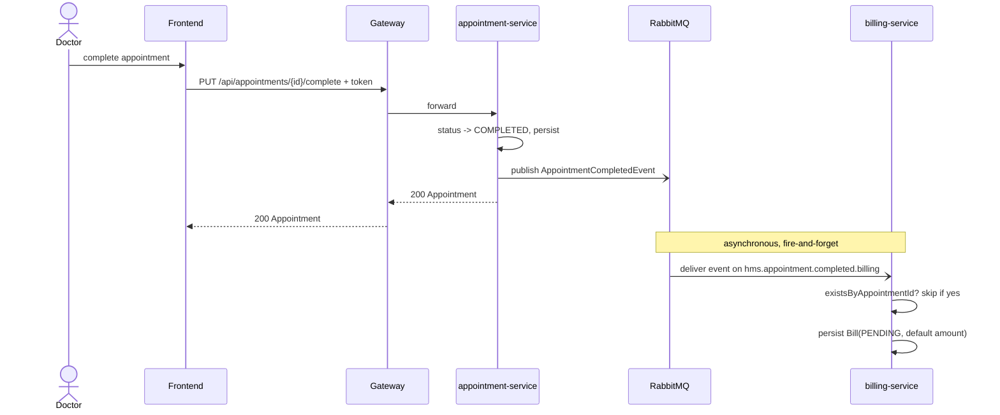
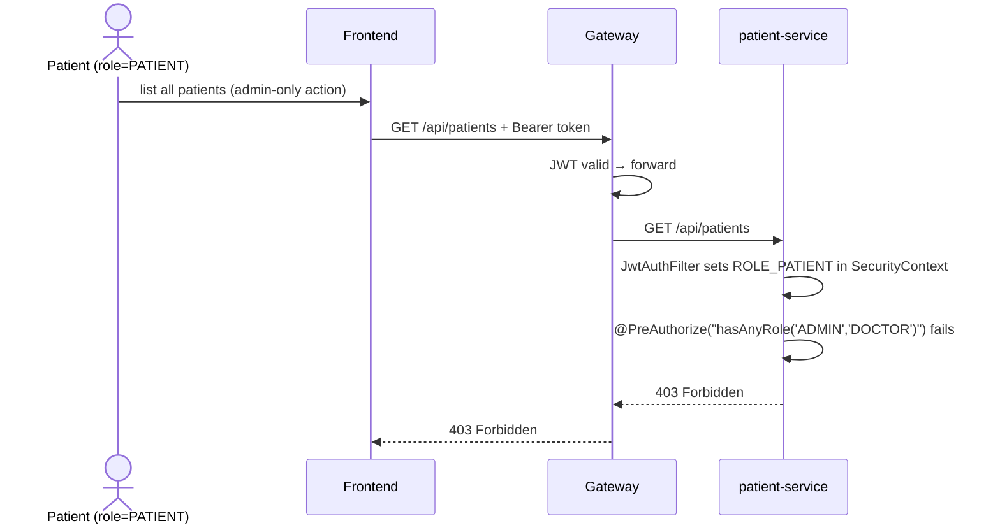

# Sequence diagrams

## 1. Login + booking an appointment

```mermaid
sequenceDiagram
    actor U as User
    participant FE as Frontend
    participant GW as Gateway
    participant AUTH as auth-service
    participant APP as appointment-service
    participant PAT as patient-service
    participant DOC as doctor-service

    U->>FE: enter credentials
    FE->>GW: POST /api/auth/login
    GW->>AUTH: forward (no JWT required)
    AUTH-->>GW: 200 { token, role }
    GW-->>FE: 200 { token, role }
    FE->>FE: store token in localStorage

    U->>FE: book appointment
    FE->>GW: POST /api/appointments + Bearer token
    GW->>GW: validate JWT signature & expiry
    GW->>APP: forward
    APP->>APP: validate JWT
    APP->>PAT: Feign GET /api/patients/{id} + token
    PAT-->>APP: 200 PatientSummary
    APP->>DOC: Feign GET /api/doctors/{id} + token
    DOC-->>APP: 200 DoctorSummary
    APP->>APP: persist Appointment(SCHEDULED)
    APP-->>GW: 201 Appointment
    GW-->>FE: 201 Appointment
    FE-->>U: success
```

## 2. Async flow: appointment completion → bill auto-generated

```mermaid
sequenceDiagram
    actor D as Doctor
    participant FE as Frontend
    participant GW as Gateway
    participant APP as appointment-service
    participant MQ as RabbitMQ
    participant BIL as billing-service

    D->>FE: complete appointment
    FE->>GW: PUT /api/appointments/{id}/complete + token
    GW->>APP: forward
    APP->>APP: status -> COMPLETED, persist
    APP-)MQ: publish AppointmentCompletedEvent
    APP-->>GW: 200 Appointment
    GW-->>FE: 200 Appointment

    Note over MQ,BIL: asynchronous, fire-and-forget
    MQ-)BIL: deliver event on hms.appointment.completed.billing
    BIL->>BIL: existsByAppointmentId? skip if yes
    BIL->>BIL: persist Bill(PENDING, default amount)
```

## 3. Authenticated read with role enforcement

```mermaid
sequenceDiagram
    actor U as Patient (role=PATIENT)
    participant FE as Frontend
    participant GW as Gateway
    participant PAT as patient-service

    U->>FE: list all patients (admin-only action)
    FE->>GW: GET /api/patients + Bearer token
    GW->>GW: JWT valid → forward
    GW->>PAT: GET /api/patients
    PAT->>PAT: JwtAuthFilter sets ROLE_PATIENT in SecurityContext
    PAT->>PAT: @PreAuthorize("hasAnyRole('ADMIN','DOCTOR')") fails
    PAT-->>GW: 403 Forbidden
    GW-->>FE: 403 Forbidden
```
