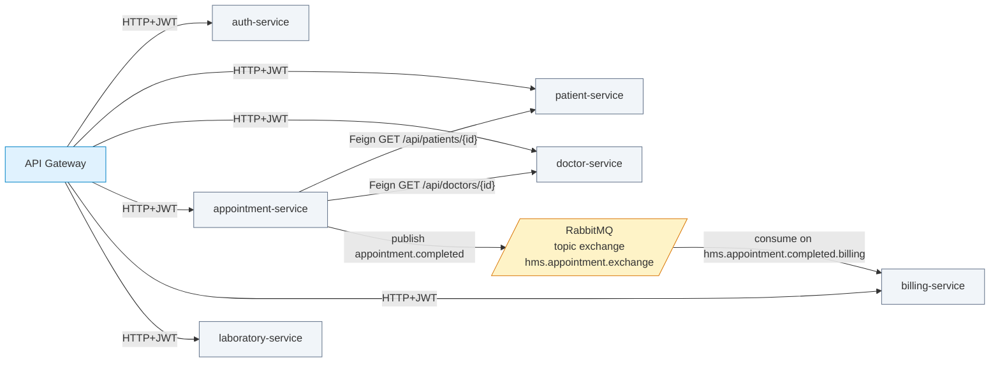

# Service interaction diagram

Shows the synchronous (Feign) and asynchronous (RabbitMQ) calls between services.

```mermaid
flowchart LR
    GW[API Gateway]:::edge

    AUTH[auth-service]:::svc
    PAT[patient-service]:::svc
    DOC[doctor-service]:::svc
    APP[appointment-service]:::svc
    BIL[billing-service]:::svc
    LAB[laboratory-service]:::svc

    MQ[/RabbitMQ<br/>topic exchange<br/>hms.appointment.exchange/]:::mq

    GW -- HTTP+JWT --> AUTH
    GW -- HTTP+JWT --> PAT
    GW -- HTTP+JWT --> DOC
    GW -- HTTP+JWT --> APP
    GW -- HTTP+JWT --> BIL
    GW -- HTTP+JWT --> LAB

    APP -- "Feign GET /api/patients/{id}" --> PAT
    APP -- "Feign GET /api/doctors/{id}" --> DOC

    APP -- "publish appointment.completed" --> MQ
    MQ -- "consume on hms.appointment.completed.billing" --> BIL

    classDef edge fill:#e0f2fe,stroke:#0284c7
    classDef svc fill:#f1f5f9,stroke:#64748b
    classDef mq fill:#fef3c7,stroke:#d97706
```
