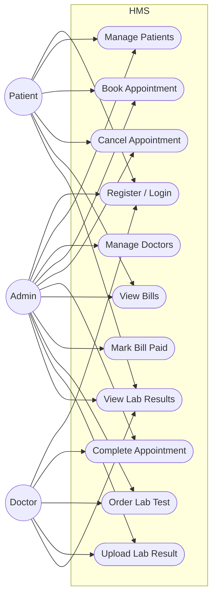

# Use case diagram

```mermaid
flowchart LR
    Admin((Admin))
    Doctor((Doctor))
    Patient((Patient))

    subgraph HMS
        UC1([Register / Login])
        UC2([Manage Patients])
        UC3([Manage Doctors])
        UC4([Book Appointment])
        UC5([Cancel Appointment])
        UC6([Complete Appointment])
        UC7([View Bills])
        UC8([Mark Bill Paid])
        UC9([Order Lab Test])
        UC10([Upload Lab Result])
        UC11([View Lab Results])
    end

    Admin --> UC1
    Admin --> UC2
    Admin --> UC3
    Admin --> UC4
    Admin --> UC5
    Admin --> UC6
    Admin --> UC7
    Admin --> UC8
    Admin --> UC9
    Admin --> UC10
    Admin --> UC11

    Doctor --> UC1
    Doctor --> UC6
    Doctor --> UC9
    Doctor --> UC10
    Doctor --> UC11

    Patient --> UC1
    Patient --> UC2
    Patient --> UC4
    Patient --> UC5
    Patient --> UC7
    Patient --> UC11
```
